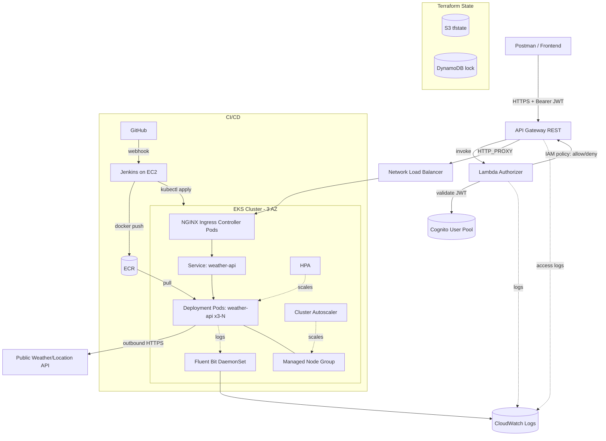

# Max Weather — DevOps Assessment: Phân tích & Thiết kế Kiến trúc

> **Loại tài liệu**: Analysis + Architecture Design (KHÔNG phải execution plan)
> **Cloud**: AWS
> **Issuer**: 101 Digital PTE. LTD.
> **Submission**: `anurudda@101digital.io`, `rajiv@101digital.io`

---

## 1. TL;DR (Tóm tắt một trang)

**Max Weather** cần một nền tảng dự báo thời tiết chạy 24/7 trên AWS, expose dưới dạng API có OAuth2 protection, deploy bằng Kubernetes, scale theo traffic, và toàn bộ infra được mô tả bằng Terraform có thể tái sử dụng.

**Kiến trúc đề xuất** (one-liner):
> **API Gateway** (REST + Lambda Authorizer cho OAuth2 qua Cognito) → **NLB** → **Nginx Ingress Controller** → **EKS** (multi-AZ, HPA + Cluster Autoscaler) → app proxy tới public weather API. **Jenkins** trên EC2 build Docker → push **ECR** → deploy staging/prod. Logs đẩy về **CloudWatch** qua Fluent Bit. Toàn bộ infra trong **Terraform** với module + remote state trên S3.

**Effort estimate (cho đến khi submit)**: 5–7 ngày làm việc (1 người), bao gồm cả thử nghiệm và viết documentation.

---

## 2. Phân tích Yêu cầu (Requirements Breakdown)

### 2.1 Functional Requirements

| # | Yêu cầu (PDF) | Diễn giải kỹ thuật |
|---|---|---|
| FR-1 | "Expose weather forecast as APIs" | REST API qua API Gateway, app trong K8s là HTTP proxy tới public weather API (Google location / OpenWeather…) |
| FR-2 | "OAuth2 authorization" | Custom **Lambda Authorizer** validate JWT token (Cognito issued) tại API Gateway |
| FR-3 | "CI/CD: staging → prod" | Jenkins pipeline với 2 stage deploy + manual approval gate |
| FR-4 | "Logs → CloudWatch" | Fluent Bit DaemonSet trên EKS đẩy container logs; Lambda + API GW logs natively |
| FR-5 | "Postman demo with auth" | Postman collection: lấy token từ Cognito → gọi API → nhận response |

### 2.2 Non-Functional Requirements

| # | Yêu cầu | Cách hiện thực |
|---|---|---|
| NFR-1 | High availability 24/7 | EKS multi-AZ (3 AZ), node group span AZ, ALB/NLB multi-AZ, deployment ≥ 3 replica, PodDisruptionBudget |
| NFR-2 | Scalable theo traffic peak (sáng) | **HPA** (CPU/memory) + **Cluster Autoscaler** (node level); có thể thêm scheduled scaling buổi sáng |
| NFR-3 | "Production ready" | Health/readiness probes, resource requests/limits, secret từ AWS Secrets Manager, IRSA cho IAM |
| NFR-4 | Fault tolerance | Multi-AZ, retry/circuit breaker tại app, graceful shutdown, rolling update strategy |
| NFR-5 | Portable infra (cross env/cloud) | Terraform module hoá, parameterized qua `tfvars`, separate `envs/staging` & `envs/prod` |

### 2.3 Constraints & Assumptions (từ PDF)

- ✅ **KHÔNG cần** implement backend → app chỉ là proxy
- ✅ **KHÔNG bắt buộc** define API Gateway resources trong Terraform (manual qua console OK)
- ✅ Custom Lambda authorizer — **bắt buộc**
- ✅ Infra Terraform — **bắt buộc và phải modular**
- ⚠️ "CloudWatch services and scaling code **phải được test** trước khi submit" → cần evidence

---

## 3. Deliverables Checklist

| # | Deliverable | Định dạng đề xuất | Status |
|---|---|---|---|
| D1 | Architecture diagram | PNG + draw.io / Mermaid embed trong README | ☐ |
| D2 | Terraform scripts (modular) | `infra/` directory với modules | ☐ |
| D3a | K8s Deployment YAML | `k8s/deployment.yaml` | ☐ |
| D3b | K8s Service YAML | `k8s/service.yaml` | ☐ |
| D3c | Nginx Ingress Controller | Helm chart hoặc manifest | ☐ |
| D3d | Nginx Ingress (resource) | `k8s/ingress.yaml` | ☐ |
| D4 | Jenkinsfile | `Jenkinsfile` ở root + `ci/` scripts | ☐ |
| D5 | API trên AWS API Gateway | URL endpoint hoạt động + screenshot | ☐ |
| D6 | Postman collection | `docs/postman/*.json` + README hướng dẫn | ☐ |
| D7 | Test evidence (CloudWatch + scaling) | `docs/evidence/` (đã có sẵn convention) | ☐ |
| D8 | Email submission | Send to anurudda@ + rajiv@101digital.io kèm Git repo URL | ☐ |

---

## 4. Architecture Design

### 4.1 Component Inventory

| Layer | Component | Mục đích |
|---|---|---|
| **Edge / Auth** | Route53 (optional) | Custom domain |
| | API Gateway (REST, regional) | Public entry point, throttling, request validation |
| | Lambda Authorizer (Node.js 20.x) | Validate Cognito JWT, return IAM policy |
| | Amazon Cognito User Pool + App Client | OAuth2 IdP (`client_credentials` flow cho machine-to-machine) |
| **Network** | VPC (10.0.0.0/16) | Tenant isolation |
| | Public subnets x3 (1 per AZ) | NLB, NAT GW |
| | Private subnets x3 (1 per AZ) | EKS worker nodes |
| | Internet Gateway, NAT Gateway | Outbound internet for nodes |
| **Container** | EKS Cluster (1.30+) | Managed K8s control plane |
| | Managed Node Group (t3.medium, 2–10 nodes) | Worker nodes, auto-scale |
| | Cluster Autoscaler | Node-level scaling |
| | NGINX Ingress Controller (Helm) | L7 ingress, exposed via NLB |
| | Fluent Bit DaemonSet | Ship pod logs → CloudWatch |
| | AWS Load Balancer Controller (optional) | Để quản lý NLB từ Service annotation |
| **App** | Deployment: weather-api (3 replica) | Stateless HTTP proxy tới public weather API |
| | Service ClusterIP | Internal DNS cho Ingress |
| | HPA (target 60% CPU) | Pod autoscale |
| | ConfigMap + Secret (Secrets Manager via External Secrets / IRSA) | Config + API keys |
| **Registry** | ECR repo: `weather-api` | Docker image registry |
| **CI/CD** | Jenkins on EC2 (t3.medium) | Pipeline orchestrator |
| | GitHub webhook → Jenkins | Trigger build on push |
| **Observability** | CloudWatch Log Groups | App logs, Lambda logs, API GW access logs |
| | CloudWatch Alarms | CPU/memory/error rate alerts |
| | (Optional) CloudWatch Container Insights | EKS metrics |
| **State** | S3 bucket: `max-weather-tfstate` | Terraform remote state |
| | DynamoDB table: `max-weather-tflock` | State locking |
| **IAM** | IRSA roles | Pod-level IAM (Secrets Manager, S3 read) |
| | Jenkins IAM role | Push ECR, kubectl exec, update K8s |

### 4.2 Architecture Diagram (Mermaid)



### 4.3 Request Lifecycle (happy path)

1. Client gọi `POST /oauth2/token` của Cognito → nhận JWT access token
2. Client gọi `GET https://api.example.com/weather?city=Hanoi` với header `Authorization: Bearer <jwt>`
3. API Gateway nhận request → invoke Lambda Authorizer
4. Authorizer parse JWT, verify chữ ký với Cognito JWKs, kiểm tra `exp`/`aud` → trả về IAM policy `Allow`
5. API Gateway cache policy (TTL 5 phút) → forward request qua HTTP_PROXY tới NLB DNS
6. NLB route tới NGINX Ingress pod (port 80)
7. NGINX match host/path → forward tới Service `weather-api` (ClusterIP)
8. Service load-balance tới một pod
9. Pod gọi public weather API, trả JSON về client
10. Logs từ pod được Fluent Bit ship tới CloudWatch log group `/aws/eks/max-weather/weather-api`

### 4.4 Terraform Module Map

```
infra/
├── bootstrap/                # Tạo S3+DynamoDB cho remote state (chạy 1 lần, local state)
├── modules/
│   ├── network/              # VPC, subnets, NAT, IGW, RT
│   ├── eks/                  # Cluster, node group, addons, IRSA
│   ├── ecr/                  # ECR repo + lifecycle policy
│   ├── cognito/              # User pool + app client + domain
│   ├── lambda-authorizer/    # Lambda function + IAM + log group
│   ├── cloudwatch/           # Log groups, metric filters, alarms
│   ├── jenkins/              # EC2 + SG + IAM instance profile
│   └── iam/                  # Cross-cutting roles
└── envs/
    ├── staging/
    │   ├── main.tf           # Compose modules
    │   ├── variables.tf
    │   ├── terraform.tfvars  # (gitignored, sample committed)
    │   └── backend.tf        # S3 backend config
    └── prod/
        └── ... (same structure, different tfvars)
```

**Parameterization examples** (cho NFR-5 portability):
- `region`, `vpc_cidr`, `azs`, `cluster_version`, `node_instance_types`, `node_min/max/desired`, `app_image_tag`, `cognito_callback_urls`

---

## 5. Technology Choices & Rationale

| Quyết định | Lựa chọn | Lý do |
|---|---|---|
| Container orchestration | **EKS** (managed K8s) | PDF bắt buộc K8s; EKS giảm overhead vận hành control plane |
| OAuth2 IdP | **Amazon Cognito** | Pure-AWS, free tier rộng, không cần external account; tích hợp sẵn với API GW |
| Authorizer runtime | **Lambda Node.js 20.x** | PDF chỉ định custom Lambda; Node.js có lib `jsonwebtoken` + `jwks-rsa` mature |
| Ingress | **NGINX Ingress Controller** | PDF mandate explicitly (D3c, D3d) |
| LB type cho Nginx | **NLB** | L4 passthrough, giữ TLS termination ở Nginx; rẻ hơn ALB cho throughput cao |
| Node scaling | **Cluster Autoscaler** | Đơn giản, đủ demo; Karpenter tốt hơn nhưng setup phức tạp hơn |
| Pod scaling | **HPA on CPU 60%** | Matches "scale based on traffic" requirement |
| Logging shipper | **Fluent Bit DaemonSet** | AWS-recommended, lightweight, official CloudWatch plugin |
| CI/CD | **Jenkins on EC2** | PDF bắt buộc Jenkins; EC2 đơn giản hơn in-cluster (tránh chicken-and-egg) |
| Image registry | **ECR** | Native AWS, IAM auth, tích hợp với EKS qua IRSA |
| State storage | **S3 + DynamoDB** | Chuẩn industry; bootstrap module riêng |
| App language | **Node.js / Go (đề xuất)** | Nhẹ, startup nhanh, phù hợp HTTP proxy; Go có image nhỏ nhất |

---

## 6. Risks & Trade-offs

| Risk | Mức độ | Mitigation |
|---|---|---|
| **Cost vượt free trial** (NAT GW $32/mo/AZ, EKS $73/mo) | High | Single-AZ NAT khi demo; teardown ngay sau khi quay video bằng `cloud-nuke` (đã có sẵn) |
| **EKS bootstrap thời gian** (~15-20 phút) | Medium | Document trước, không demo live; dùng `terraform apply -target` để bring up từng phần |
| **Lambda cold start ảnh hưởng latency authorizer** | Medium | Provisioned concurrency hoặc enable authorizer caching (TTL 300s) |
| **CloudWatch + scaling test evidence** (PDF mandate) | High | Tạo `docs/evidence/` với screenshots + CLI output: `kubectl get hpa`, CloudWatch Insights queries, load-test với `hey`/`k6` |
| **Nginx Ingress vs ALB Ingress confusion** | Low | Bám sát PDF: Nginx Ingress Controller; NLB là backing LB chứ không phải ALB Ingress Controller |
| **Postman OAuth2 flow setup** | Low | Dùng `client_credentials` grant cho M2M; Postman có wizard sẵn |
| **Repo bảo mật**: leak AWS keys, secrets | High | `.gitignore` đã có sẵn `.env`, `.tfvars`, `.pem`; dùng GitHub repo private |

---

## 7. Submission Checklist

```
Repository structure đề xuất:
├── README.md                      # Tổng quan + setup + demo instructions
├── docs/
│   ├── architecture.png           # D1
│   ├── architecture.drawio
│   ├── postman/
│   │   └── max-weather.postman_collection.json   # D6
│   └── evidence/
│       ├── 01-terraform-apply/
│       ├── 02-eks-nodes/
│       ├── 03-cloudwatch-logs/    # Test evidence (PDF mandate)
│       ├── 04-hpa-scaling/        # Test evidence (PDF mandate)
│       ├── 05-api-gateway/
│       ├── 06-postman-demo/
│       ├── 07-jenkins-pipeline/
│       └── 08-jenkins/            # (đã có sẵn trong .gitignore)
├── infra/                         # D2 — Terraform
│   ├── bootstrap/
│   ├── modules/
│   └── envs/{staging,prod}/
├── k8s/                           # D3
│   ├── deployment.yaml
│   ├── service.yaml
│   ├── ingress.yaml
│   └── nginx-controller/          # Helm values hoặc manifest
├── lambda-authorizer/             # Custom Lambda code
│   ├── src/
│   └── package.json
├── app/                           # Weather API proxy
│   ├── src/
│   ├── Dockerfile
│   └── package.json
├── Jenkinsfile                    # D4
└── ci/                            # Jenkins helper scripts
```

**Email submission template**:
```
To: anurudda@101digital.io, rajiv@101digital.io
Subject: DevOps Technical Assessment Submission - <Your Name>

Hi,

Please find my submission for the DevOps Technical Assessment.

GitHub repo: https://github.com/<user>/<repo> (please grant access to <emails>)
Submitter email: <your-email>

Demo instructions and architecture overview are in the README.md.

Best regards,
<Your Name>
```

---

## 8. Recommended Next Steps

Đây là tài liệu **Analysis + Architecture Design** — chưa phải execution plan. Để bắt đầu thực thi, bạn có 2 lựa chọn:

1. **Yêu cầu Prometheus tạo Work Plan chi tiết** — task-by-task breakdown, dependency waves, QA scenarios cho từng module → để Sisyphus thực thi qua `/start-work`
2. **Thực thi tay** dựa trên architecture design này — phù hợp nếu bạn muốn tự kiểm soát tiến độ

**Câu hỏi tiếp theo**:
- Bạn có muốn tôi **iterate** thêm phần nào trong tài liệu này không? (vd: chi tiết hơn về Terraform module, hoặc thêm pseudo-code Jenkinsfile, hoặc design Postman collection)
- Hay chuyển sang tạo **execution work plan** đầy đủ?
